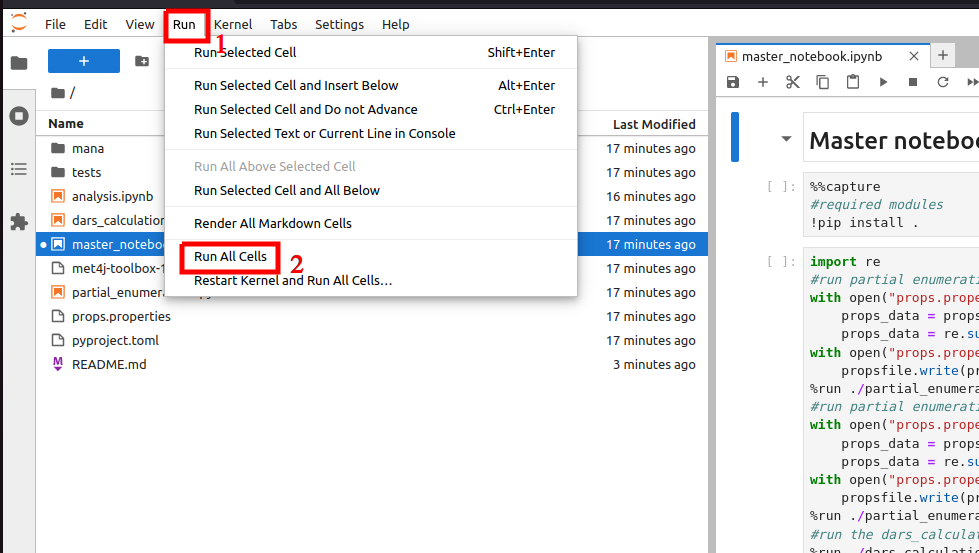

# MANA
MANA: mMoA identification Assisted by modelling and Network Analysis
This repository contains code and a test case associated with the article named : 

    New genome scale network modelling and mining workflow to detect metabolic modulations induced by the exposure to xenobiotics

The workflow presented in this article aims at improving our understanding of the metabolic Mechanism of Action and can be divided in three steps:
1. Condition-specific metabolic network modelling with partial enumeration from gene expression data
2. Identify Differentially Activated Reactions (DAR) from the modelised sets of condition-specific metabolic networks
3. Network anaylsis to extract minimal subnetworks représentative of the chemical's mMoA

Each step of the workflow is performed by a jupyter notebook:
* **partial_enumeration.ipynb**
* **dars_calculation.ipynb**
* **analysis.ipynb**

Properties and parameters for the workflow are stored in a unique file to update in order to change parameters such as compound, dose, time, etc:
* **props.properties**

The package source code is contained in the mana folder and can be installed as a python module.
## Installation:
### Requirements:

* Python3.9X
* Java 11
* Met4j 1.2.2 jar (stored in this repository)
* CPLEX 12.10 or newer (not required for the test case)

### Installing the package

From the root directory of the MANA repository, enter the following command:

<code>pip install .</code>

### Launching the main jupyter notebook (test case)

From the root directory of the MANA repository, enter the following command:

<code>python3 -m jupyterlab master_notebook.ipynb</code>

Once JupyterLab opened in your navigator, you can click on "Run", then click on "Run All Cells" as illustrated below.

It will perform the complete workflow on the test case (PHH exposed to amiodarone during 24h and associated controls).
The notebook will pause near the end of the workflow waiting for you to provide the desired number of clusters during the hierarchical clustering step.

## Localisation of the main results files:

[Annotated cluster 1](tests/analysis/clusters_annotation_tables/amiodarone_24_hr_extracellexclude_cluster1_table.xlsx)

[Annotated cluster 2](tests/analysis/clusters_annotation_tables/amiodarone_24_hr_extracellexclude_cluster2_table.xlsx)

[Subnetwork 1 reactions list](tests/analysis/subnetwork_reactions/amiodarone_24_hr_extracellexclude_cluster1_undirected_r2_noisecond_extracell.txt)

[Subnetwork 2 reactions list](tests/analysis/subnetwork_reactions/amiodarone_24_hr_extracellexclude_cluster2_undirected_r2_noisecond_extracell.txt)
